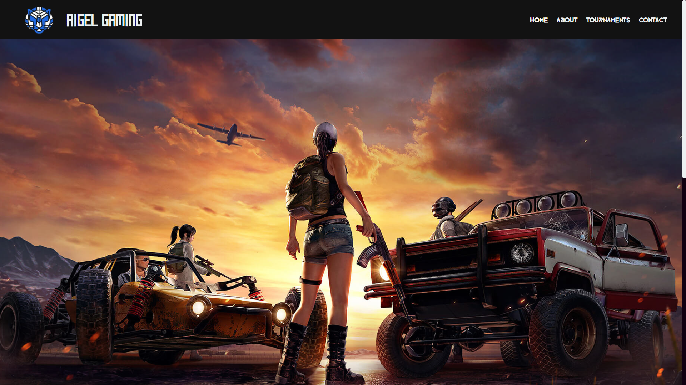
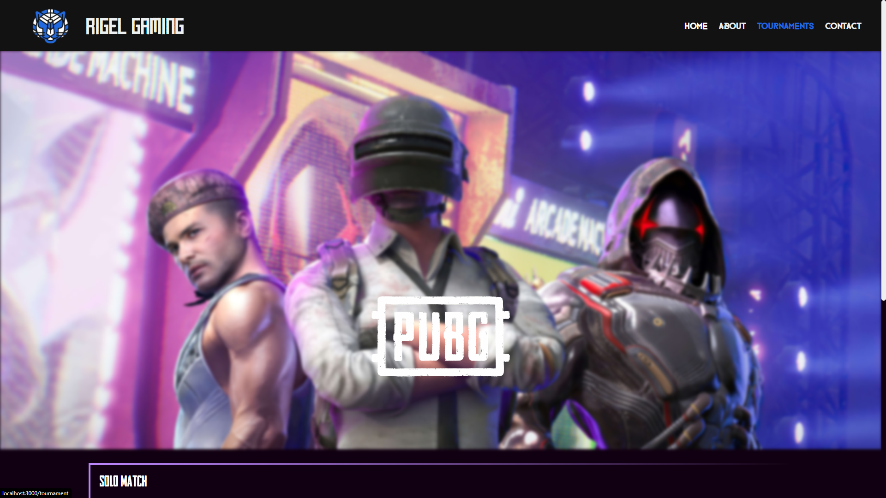

# Rigel Gaming

## Webpage Preview

### Home page

### Tournament Page

## Available Scripts

In the project directory, you can run:

### `nodemon server.js`

Runs the server in http://localhost:3000.

This will be the server of the project.

### Run MongoDB server for storage purposes
